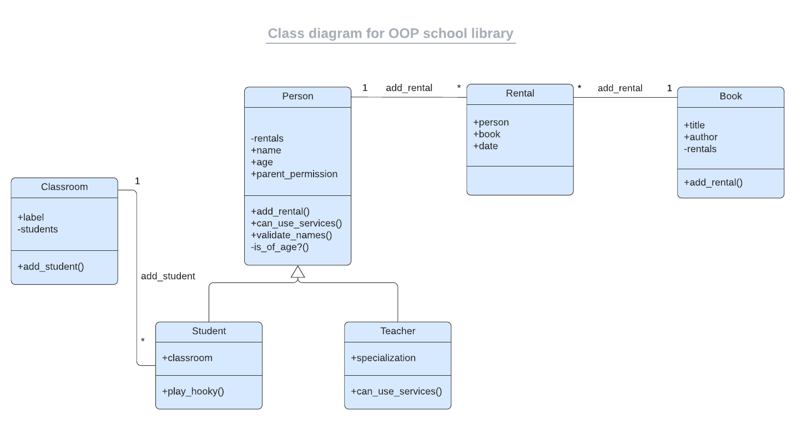

<a name="readme-top"></a>

<!-- TABLE OF CONTENTS -->

# 📗 Table of Contents

- [📗 Table of Contents](#-table-of-contents)
- [📖 Ruby OOP: School Library ](#-ruby-oop-school-library-)
  - [🛠 Built With ](#-built-with-)
    - [Tech Stack ](#tech-stack-)
    - [Key Features ](#key-features-)
  - [💻 Getting Started ](#-getting-started-)
    - [Prerequisites](#prerequisites)
    - [Setup](#setup)
    - [Usage](#usage)
  - [👥 Authors ](#-authors-)
  - [🔭 Future Features ](#-future-features-)
  - [🤝 Contributing ](#-contributing-)
  - [⭐️ Show your support ](#️-show-your-support-)
  - [🙏 Acknowledgments ](#-acknowledgments-)
  - [📝 License ](#-license-)

<!-- PROJECT DESCRIPTION -->

# 📖 Ruby OOP: School Library <a name="about-project"></a>

This project is an exercise for Module 4 - Week 3 of the Full-Stack Developer program offered by Microverse. It uses the [Ruby](https://www.ruby-lang.org/en/) programming language to build a tool that can be used by a school to record what books are in the library and who borrows them. It uses the basic principles of object oriented programming, such as inheritance and polymorphism, to implement the set of classes shown in the following UML diagram: 


*Image source: [Microverse](https://github.com/microverseinc/curriculum-ruby/raw/main/oop/images/uml_class_diagram.png)*
## 🛠 Built With <a name="built-with"></a>

### Tech Stack <a name="tech-stack"></a>

<details>
<summary>Ruby</summary>
  <ul>
    <li><a href="https://www.ruby-lang.org/en/">Ruby</a></li>
  </ul>
</details>

<!-- Features -->

### Key Features <a name="key-features"></a>

Users can use the command line interface to: 
- Add new students or teachers
- Add new books
- Save records of who borrowed a given book and when

<p align="right">(<a href="#readme-top">back to top</a>)</p>


<!-- GETTING STARTED -->

## 💻 Getting Started <a name="getting-started"></a>

To get a local copy up and running, follow these steps.

### Prerequisites

In order to run this project you need [Ruby](https://www.ruby-lang.org/en/) installed on your machine. You can download the installer for your specific operating system [right here](https://www.ruby-lang.org/en/documentation/installation/).

### Setup

Clone this repository to your desired folder:

```sh
  cd my-folder
  git clone https://github.com/henokkhm/microverse-ruby-oop-school-library.git
```

### Usage

To run the Ruby file, first open the terminal, then change directories to `microverse-ruby-oop-school-library`. After this, you can run the script using the `ruby` command followed by the file's name.

Example: ```ruby school_library.rb```

<p align="right">(<a href="#readme-top">back to top</a>)</p>

<!-- AUTHORS -->

## 👥 Authors <a name="authors"></a>


👤 **Henok Kirubel Hailemariam**

- GitHub: [@henokkhm](https://github.com/henokkhm)
- Twitter: [@henokkhm](https://twitter.com/henokkhm)
- LinkedIn: [LinkedIn](https://www.linkedin.com/in/henokkhm/)

<p align="right">(<a href="#readme-top">back to top</a>)</p>

<!-- FUTURE FEATURES -->

## 🔭 Future Features <a name="future-features"></a>

- [ ] **Preserve data in files**
- [ ] **Add unit tests**

<p align="right">(<a href="#readme-top">back to top</a>)</p>

<!-- CONTRIBUTING -->

## 🤝 Contributing <a name="contributing"></a>

Contributions, issues, and feature requests are welcome!

Feel free to check the [issues page](../../issues/).

<p align="right">(<a href="#readme-top">back to top</a>)</p>

<!-- SUPPORT -->

## ⭐️ Show your support <a name="support"></a>


If you like this project, you can contribute to it. You are also welcome to give it a star on GitHub.

<p align="right">(<a href="#readme-top">back to top</a>)</p>

<!-- ACKNOWLEDGEMENTS -->

## 🙏 Acknowledgments <a name="acknowledgements"></a>

I would like to thank Microverse for teaching and enforcing professional level practices.

<p align="right">(<a href="#readme-top">back to top</a>)</p>

<!-- LICENSE -->

## 📝 License <a name="license"></a>

This project is [MIT](./LICENSE) licensed.

<p align="right">(<a href="#readme-top">back to top</a>)</p>
